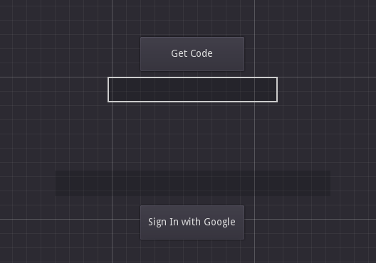

> You can query the Firebase Auth backend through a REST API. This can be used for various operations such as creating new users, signing in existing ones and editing or deleting these users.  
This plugin offers several methods to call these APIs just with one line of code.

## Contents on this page:
- [Signup with Email](https://github.com/WolfgangSenff/GodotFirebase/wiki/Authentication-and-User-Management#signup-with-email)
- [Login with Email](https://github.com/WolfgangSenff/GodotFirebase/wiki/Authentication-and-User-Management#login-with-email)
- [Login Anonymously](https://github.com/WolfgangSenff/GodotFirebase/wiki/Authentication-and-User-Management#login-anonymously)
- [Login with OAuth (Google)](https://github.com/WolfgangSenff/GodotFirebase/wiki/Authentication-and-User-Management#login-with-oauth-google)
- [Verify User Account](https://github.com/WolfgangSenff/GodotFirebase/wiki/Authentication-and-User-Management#verify-user-account)
- [Get User Data](https://github.com/WolfgangSenff/GodotFirebase/wiki/Authentication-and-User-Management#get-user-data)
- [Change User Email](https://github.com/WolfgangSenff/GodotFirebase/wiki/Authentication-and-User-Management#change-user-email)
- [Change User Password](https://github.com/WolfgangSenff/GodotFirebase/wiki/Authentication-and-User-Management#change-user-password)
- [Send Password Reset Email](https://github.com/WolfgangSenff/GodotFirebase/wiki/Authentication-and-User-Management#send-password-reset-email)
- [Delete User Account](https://github.com/WolfgangSenff/GodotFirebase/wiki/Authentication-and-User-Management#delete-user-account)
- [Examples](https://github.com/WolfgangSenff/GodotFirebase/wiki/Authentication-and-User-Management#examples)

***

## Signup with Email
```
Firebase.Auth.signup_with_email(email, password)
```

This will create the login_request_body variable and insert the correct data into it.

```python
var login_request_body = {
    "email":"",
    "password":"",
    "returnSecureToken": true
   }
```

From there the script will POST the data to the `signup_request_url` and add the user to the application  
<p align="right"><a href="#contents-on-this-page">Back</a></p>  


***
## Login with Email
```
Firebase.Auth.login_with_email(email, password)
```
[**Usage Example**](#ex-login-with-email-and-password)

This will create the login_request_body variable and insert the correct data into it.

```python
var login_request_body = {
    "email":"",
    "password":"",
    "returnSecureToken": true
   }
```

From there the script will POST the data to the `signin_request_url`, and wait for a response. The function `func _on_FirebaseAuth_request_completed(result, response_code, headers, body)` will take that response and parse it out for you.

#### Unable to parse body
If the script is unable to parse the body, it will print our an error to the console and 'return' out of the function

#### Body has RESPONSE_SIGNIN, RESPONSE_SIGNUP
If the response body has `RESPONSE_SIGNIN, RESPONSE_SIGNUP`, the user will be logged in and the refresh countdown will start
This refresh is needed for Firebase, as there is a limit to how long a connection can be left open, and you need the connection to stay open for updates

#### Body has RESPONSE_USERDATA
If the response body has `RESPONSE_USERDATA`, the script will emit a signal "userdata_received" with the userdata

#### Body has INVALID_EMAIL, EMAIL_NOT_FOUND, INVALID_PASSWORD, USER_DISABLED or WEAK_PASSWORD
If the response body has `INVALID_EMAIL, EMAIL_NOT_FOUND, INVALID_PASSWORD, USER_DISABLED or WEAK_PASSWORD`, the login has failed and the script will emit a signal "login_failed". It will also pass the error code and error message to be printed into the console
<p align="right"><a href="#contents-on-this-page">Back</a></p> 

***
### Login Anonymously
```python
Firebase.Auth.login_anonymous()
```

This will issue an anonymous request login to Firebase.  
If successful, an anonymous user will be identified with an UUID in users list.  
The UUID will be returned in the response body, if `login_succeeded` properly connected.  

#### Body has ADMIN_ONLY_OPERATION (400)
If the response body has `ADMIN_ONLY_OPERATION` or an `error 400 ADMIN_ONLY_OPERATION` is returned from `login_failed` signal, Anonymous Sign-in has not been enabled in your project settings.  
To do so, go to `Authentication > Sign-in method` inside your project and enable `Anonymous` (the last one in the list).  

<p align="right"><a href="#contents-on-this-page">Back</a></p> 

***
### Login with OAuth (Google)
```python
Firebase.Auth.get_google_auth()
var oath_token : String = "<An oauth token, taken from the browser. Can be pasted to a LineEdit>"
Firebase.Auth.login_with_oauth(oath_token)
```
[**Usage Example**](#ex-login-with-google-oauth)
  
In order to login with OAuth, [additional configuration passages](https://github.com/WolfgangSenff/GodotFirebase/wiki/Installation-and-Activation#additional-oauth-configuration) are mandatory. This is due to Google requirements with WEB applications.  
Once the configuration is completed, call the `Firebase.Auth.get_google_auth()` to open user's web browser redirecting to a Google Access page.  
Here the user can chose whatever Google account prefers to give permissions to log in.  
Once an account is selected, the user will be redirected to a page containing the oath token required to log in your app.  
The oath token could be pasted to a LineEdit or a custom editable text Control, then to log in with oauth call the `Firebase.Auth.login_with_oauth(oauth_token)` with `oauth_token` being the pasted token. Can directly be `$LineEdit.get_text()`.  
If login was successful, the response body will contain all user's informations related to the Google account. The user account will be listed.  


<p align="right"><a href="#contents-on-this-page">Back</a></p> 

***
### Verify User Account
```python
Firebase.Auth.send_account_verification_email()
```

This function is used to send an account verification to an email associated with an ID. This will auto generate the account_verification_body and insert the correct data. This is best used after the user registers their account.

```python
var account_verification_body = {
	"requestType":"verify_email",
	"idToken":"",
   }
```

From there the script will POST the data to the `oobcode_request_url`, and wait for a response. The email associated with the ID will receive an email with a link to verify their account.

<p align="right"><a href="#contents-on-this-page">Back</a></p> 


***
### Get User Data
```
Firebase.Auth.get_user_data()
```

This function returns all the information for the currently logged in user by send the current ID Token. The script will post the data to the `userdata_request_url`, and wait for a response.

<p align="right"><a href="#contents-on-this-page">Back</a></p> 

***
### Change User Email
> Note that there is no verify step here. This function will change the email as soon as it is run
```
Firebase.Auth.change_user_email(email)
```

This function is used to change the email address associated with the currently logged in user account. This function generates the change_email_body and inserts the correct data.

```python
var change_email_body = {
	"idToken":"",
	"email":"",
	"returnSecureToken": true,
   }
```

From there the script will post the data to the `update_account_request_url`, and wait for a response. The email for the associated user will then be updated in Firebase. Note that this function is for a user to change their own email, an admin can edit the email with the Web GUI.

<p align="right"><a href="#contents-on-this-page">Back</a></p> 

***
### Change User Password
> Note that there is no verify step here. This function will change the password as soon as it is run
```
Firebase.Auth.change_user_password(password)
```

This function is used to change the password associated with the currently logged in user account. This function generates the change_password_body and inserts the correct data.

```python
var change_password_body = {
	"idToken":"",
	"password":"",
	"returnSecureToken": true,
   }
```

From there the script will post the data to the `update_account_request_url`, and wait for a response. The password for the associated user will then be updated in Firebase. Note that this function is for a user to change their own password.

<p align="right"><a href="#contents-on-this-page">Back</a></p> 

***
### Send Password Reset Email
```
Firebase.Auth.send_password_reset_email(email)
```

This function is used to send a password reset email to a user. The function requires the email of the user who needs to be reset. It generates the password_reset_body and inserts all the correct data.

```python
var password_reset_body = {
	"requestType":"password_reset",
	"email":"",
   }
```

From there the script will POST the data to the `oobcode_request_url`, and wait for a response. The user will get an email from the system with a link to reset their password. 

<p align="right"><a href="#contents-on-this-page">Back</a></p> 

***
### Delete User Account
> Note that there is no verify step here. This function will delete the user account as soon as it is run
```
Firebase.Auth.delete_user_account()
```

This function is used to delete the user account from Firebase for the currently logged in user by sending the current ID Token. The script will post the data to the `delete_account_request_url`.

This should be used with extreme caution as there is no restoring an account once it is gone. Note that this function is for a user to delete their own account, an admin can also do this via the Web GUI.

<p align="right"><a href="#contents-on-this-page">Back</a></p> 

***
# Examples

List of examples:
- [Login with Email and Password](#ex-login-with-email-and-password)
- [Login with Google OAuth](#ex-login-with-google-oauth)

#### ex. Login with Email and Password

```python
extends Node2D

func _ready():
	Firebase.Auth.connect("login_succeeded", self, "_on_FirebaseAuth_login_succeeded")
	Firebase.Auth.connect("login_failed", self, "on_login_failed")

func _on_login_pressed():
	var email = $email.text
	var password = $password.text
	Firebase.Auth.login_with_email_and_password(email, password)

func _on_register_pressed():
	var email = $email.text
	var password = $password.text
	Firebase.Auth.signup_with_email_and_password(email, password)

func _on_FirebaseAuth_login_succeeded(auth):
	var user = Firebase.Auth.get_user_data()
	print(user)
    
func on_login_failed(error_code, message):
	print("error code: " + str(error_code))
	print("message: " + str(message))
```
<p align="right"><a href="#contents-on-this-page">Top</a> // <a href="#examples">Back</a></p>  


***
#### ex. Login with Google OAuth

```python
extends Node

func _ready():
	Firebase.Auth.connect("login_succeeded", self, "_on_login_succeeded")
	Firebase.Auth.connect("login_failed",self, "_on_login_failed")

func _on_login_succeeded(user : Dictionary):
	$Label.set_text("Successfully logged in with oAuth2 as: {email}".format({email=user.email}))

func _on_GetGoogleAuth_button_pressed():
	$Label.set_text("Waiting for an authorization code...")
	Firebase.Auth.get_google_auth()

func _on_SignInWithGoogle_button_pressed():
	$Label.set_text("Exchanging authorization code with a oath token...")
	Firebase.Auth.login_with_oauth($LineEdit.get_text())
```
<p align="right"><a href="#contents-on-this-page">Top</a> // <a href="#examples">Back</a></p>  

***