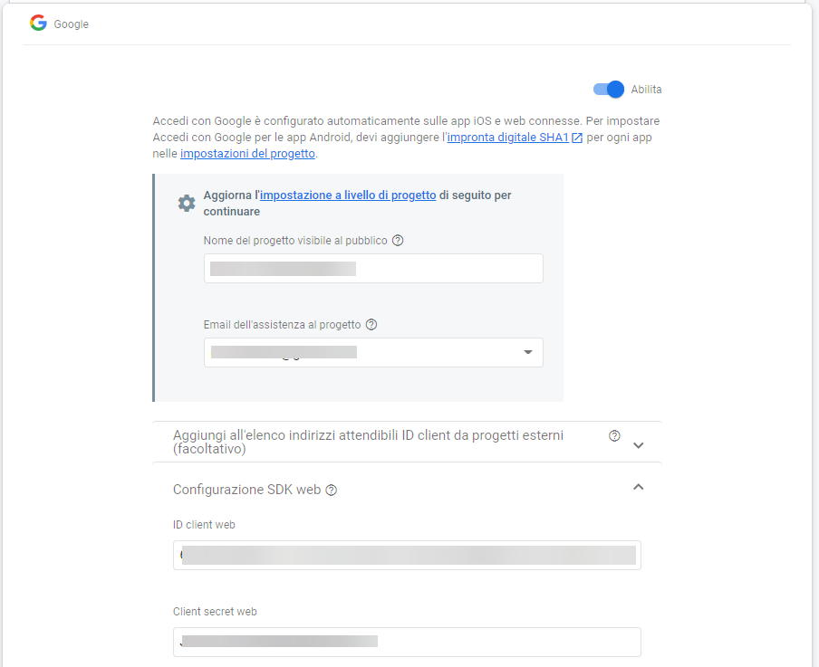
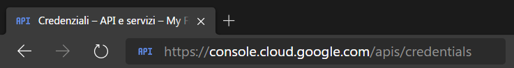
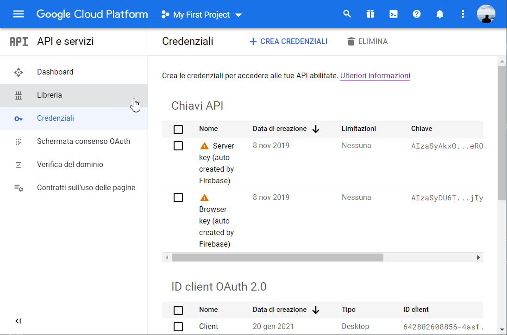
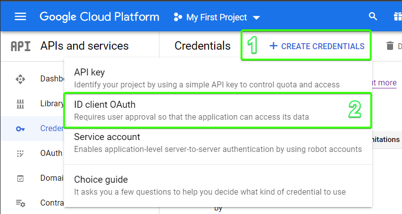
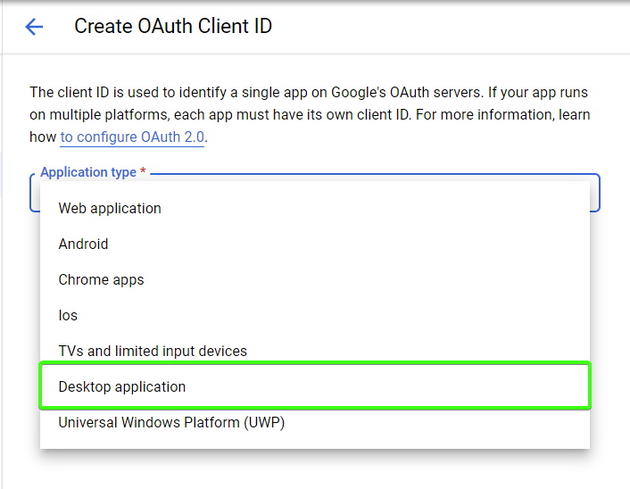
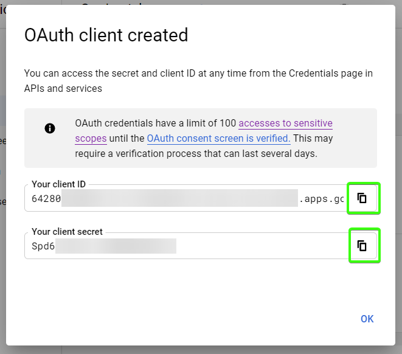
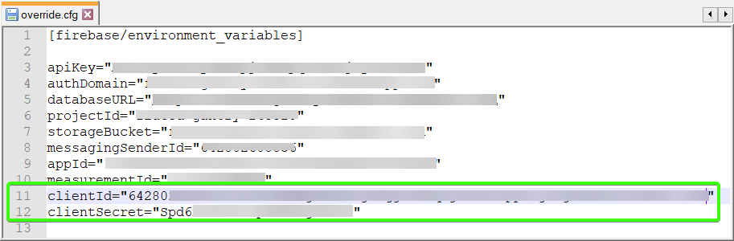
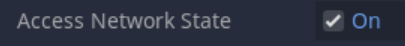
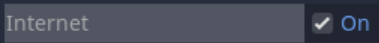

### Contents on this page

* [Installation](#installation)
* [Activation](#activation)
* [OAuth Configuration](#additional-oauth-configuration)
* [Exporting](#exporting-important)
* [Exporting - Android](#exporting-android)

## Installation
1. Install this plugin:
	1. [**recommended**] Copy this repository and extract all of the `GodotFirebase-main` contents (`addons/` folder including `.env` file) to the root of your project at `res://`  
	*--- or ---*
	2. [**not recommended - always check version**] Install this addon from the AssetLibrary inside Godot Engine's Editor: go to the `AssetLib` panel on the top bar and look for `GodotFirebase`. When choosing which folders to install, **only check `addons/` folder and `.env` file**
2. Open your Project Settings
3. Go to Plugins
4. Activate the GDFirebase plugin<br>

5. From there, you will have an autoload singleton with the variables Auth and Database. Reference it by using Firebase.Auth, etc.


<p align="right"><a href="#contents-on-this-page">Back</a></p> 

***

## Activation

1. Go create a Firebase app at console.firebase.google.com. A Guide can be found [Here](https://firebase.google.com/docs/projects/learn-more#setting_up_a_firebase_project_and_connecting_apps)

2. Once the app has been created, add a web app to it:

    1. Click on the **Project Settings** option<br>
    

    2. Click on the **Add App** button<br>
    

    3. Click the **Web App** button<br>
    

    4. Add a name to your web app and click **Register App**<br>
    

3. This will show a series of values called "config". To use them you have to:

    1) Create an `.env` file at the root of the GodotFirebase plugin (specifically, `res://addons/godot-firebase/.env`). Specify those values as environment variables in this file (see example structure below).

```
[firebase/environment_variables]

"apiKey"="",
"authDomain"="",
"databaseURL"="",
"projectId"="",
"storageBucket"="",
"messagingSenderId"="",
"appId"="",
"measurementId"=""
"clientId"=""
"clientSecret"=""
"domainUriPrefix"=""
"functionsGeoZone"=""
"cacheLocation"=""

[firebase/emulators/ports]

authentication=""
firestore=""
realtimeDatabase=""
functions=""
storage=""
dynamicLinks=""
```  

<p align="right"><a href="#contents-on-this-page">Back</a></p> 

***

## (Additional) OAuth configuration
In order to let users login with their own Google account to your app, the OAuth authentication process must be configured to work with this Plugin.  
This process will not be enabled with the main configuration, but still it is *not mandatory* to use standard login methods.  
To enable Google OAuth Authentication, follow these steps:
1. In your project, enable "Google" in "Sign-in Method":

2. Go to [console.cloud.google.com/apis/credentials](https://console.cloud.google.com/apis/credentials):

3. Select the project you are working on (and eventually, your organization):

4. Press the "+ Create Credentials" button and chose "ID Client OAuth" to register new credentials:

5. Select **Desktop Application**, then give a name to your credentials:

6. Create your credentials and copy-paste them in the configuration file `.env`, or directly in your code:

  


<p align="right"><a href="#contents-on-this-page">Back</a></p> 

***

## Exporting (Important!)  
When exporting your app for any platform at your choice, please make sure to let the engine know that the ".env" file is a resource that must be exported too.  
By default Godot will not export all those resources it doesn't consider necessary for your app to optimize its size.  
To make sure .env will be included in your binaries, 
  
Alternatively, fill the configuration dictionary directly from code, at `addons/godot-firebase/firebase/ ↝ firebase.gd`:  
  

**Note:** remember that when exporting your app in Text or Compiled mode, your files will still be accessible with some reverse engineering. To make sure your files won't be readable even if reverse engineered, [compile with an encryption key](https://docs.godotengine.org/en/stable/development/compiling/compiling_with_script_encryption_key.html).


<p align="right"><a href="#contents-on-this-page">Back</a></p> 

***

## Exporting Android
Due to how Android handles permissions for Android Apps, you will need to enable at a minimum the following `Permissions` in your Android export template.

* Access Network State

* Internet


If you do not enable these when exporting, the plugin will be unable to connect to the internet, and you will see issues like auth errors.


<p align="right"><a href="#contents-on-this-page">Back</a></p> 

***